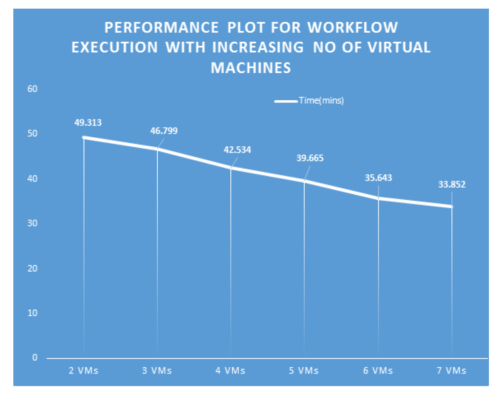
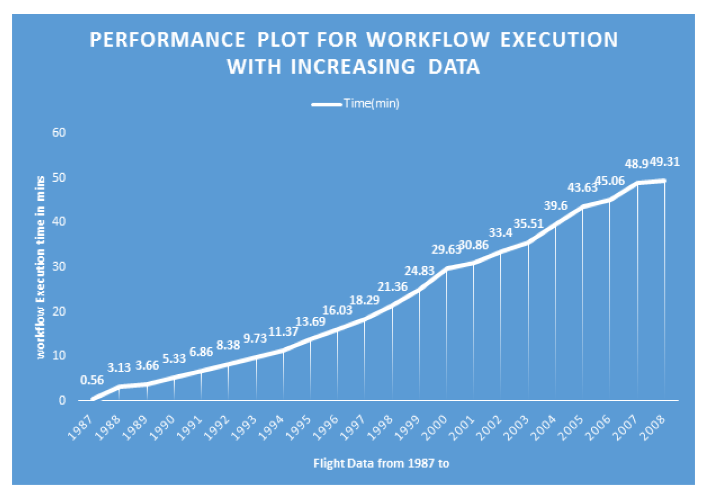

# CourseWork_BigData

This is a repository for my CS 698 Big Data course work at New Jersey Institute of Technology. I used Hadoop Map Reduce in order to solve the projects. Below is the list of the assignments: 

# Table of Contents 

1. [Finding Relative Frequency of words in a 100K wiki text file](https://github.com/PhaniKumarAdiraju/CourseWork_BigData/tree/master/Relative%20Frequency)
2. [Analyze 22 years of flight data](https://github.com/PhaniKumarAdiraju/CourseWork_BigData/tree/master/FlightProject)

# Execution Environment
The projects are developed in Apache Hadoop Environment set up in AWS instances. In order to execute the programs, you need to setup the Apache Hadoop 2.7.3 (Minimum requirement)

# Performance Results 

## [Flight Analysis Performance](https://github.com/PhaniKumarAdiraju/CourseWork_BigData/tree/master/FlightProject)

### 1. A performance measurement plot that compares the workflow execution time in response to an increasing number of VMs used for processing the entire data set (22 years)

Here we are doing an experiment on performance of workflow having mapreduce jobs by varying the number of resources used. We are keeping data constant for all the runs i.e. flight data for all 22 years.
We are starting by using Hadoop on 2 Virtual machines. The total execution time taken is 49.3 mins.
Next, we increase VM one at a time. We notice that as we increase the number of VMs there is a significant drop in time taken for execution.
###### Therefore, we conclude that performance is directly proportional to number of resources used for processing big data.

### 2. A performance measurement plot that compares the workflow execution time in response to an increasing data size (from 1 year to 22 years)

In this experiment, we want to find out performance with respect to varying input data. We are using 2 Virtual machines throughout this experiment.
First, we execute workflow on only one data file( 1987.csv). We see that execution completes in very negligeable time.
Next, we increase data by one year for every run and record the execution time. We observe that the execution time gradually increases as the input data increases.

###### Hence, we can conclude that performance is inversely proportional to input data.

Instructions on how to execute the code,  algorithm, and other details on each of these projects is with in the particular directory's readme file.
